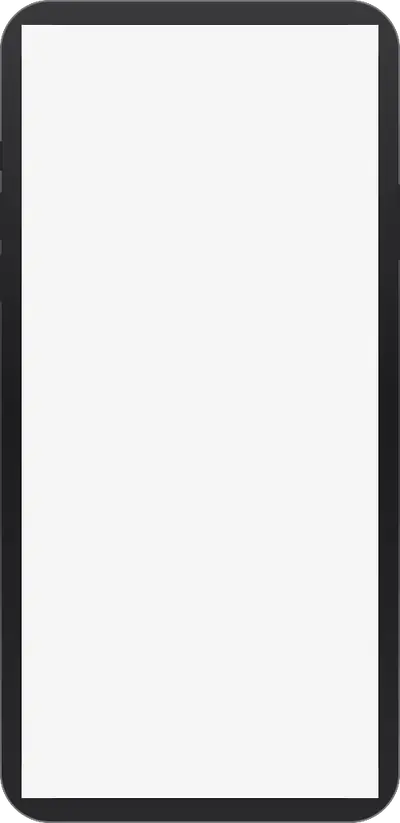
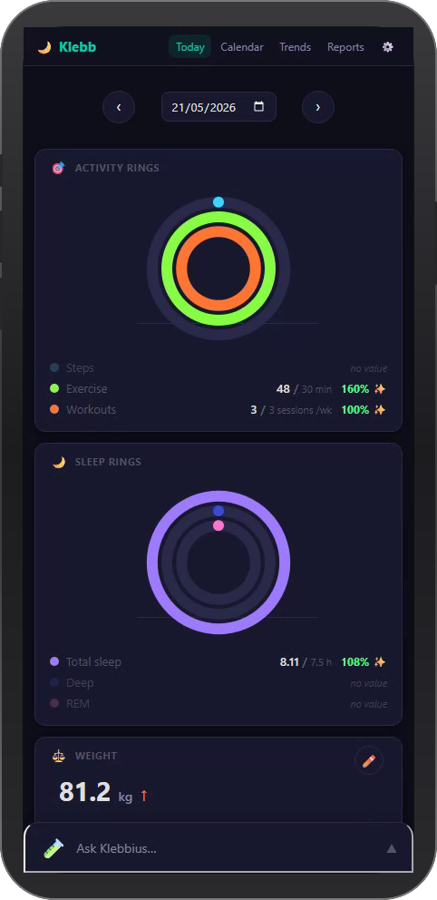
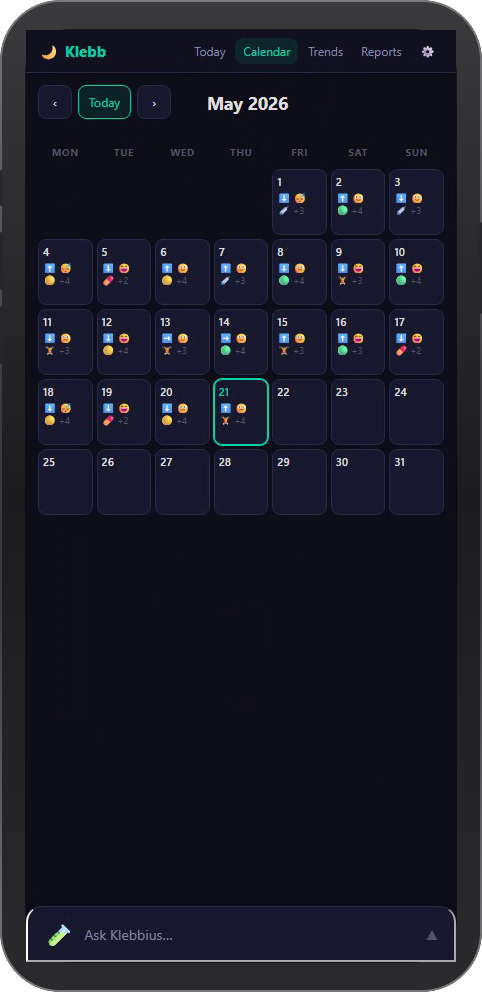
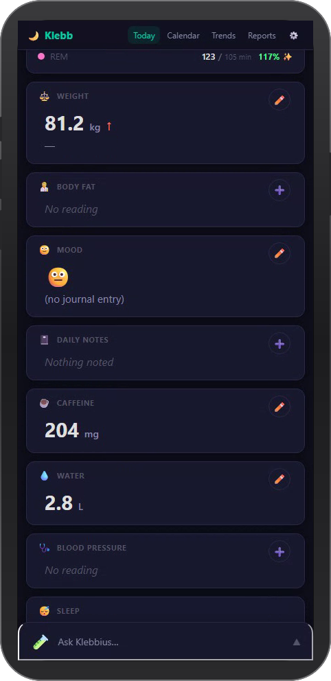
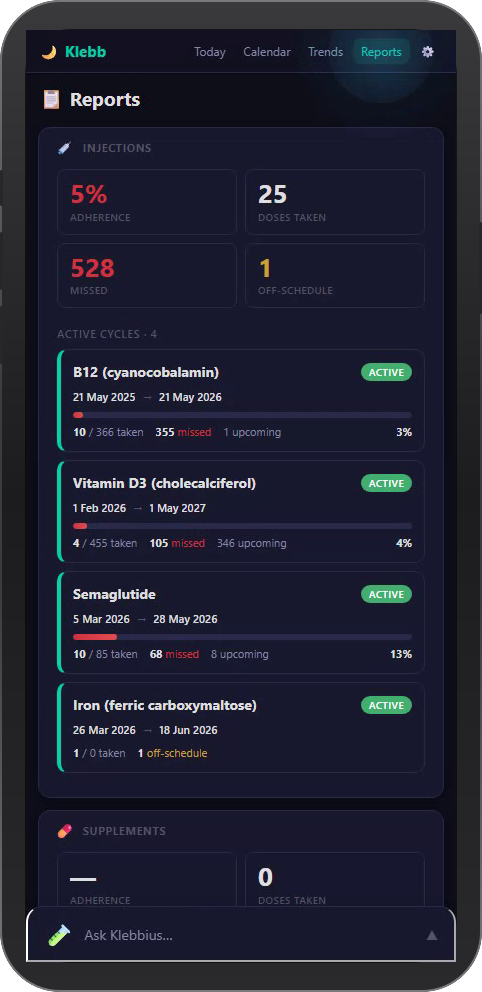
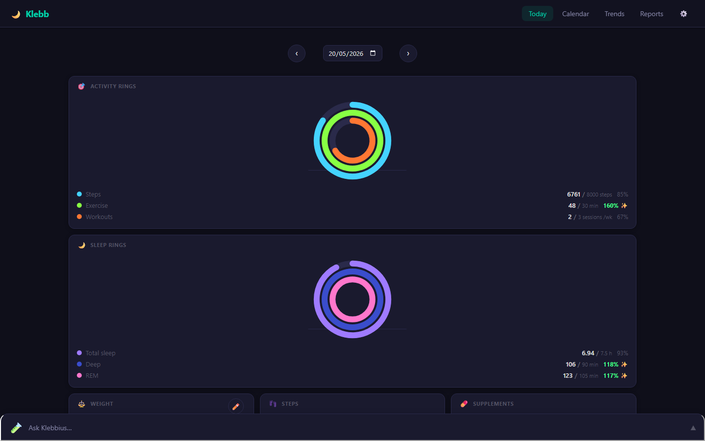
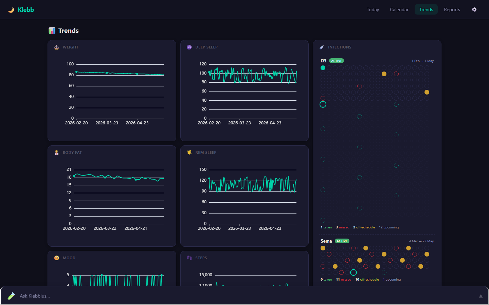
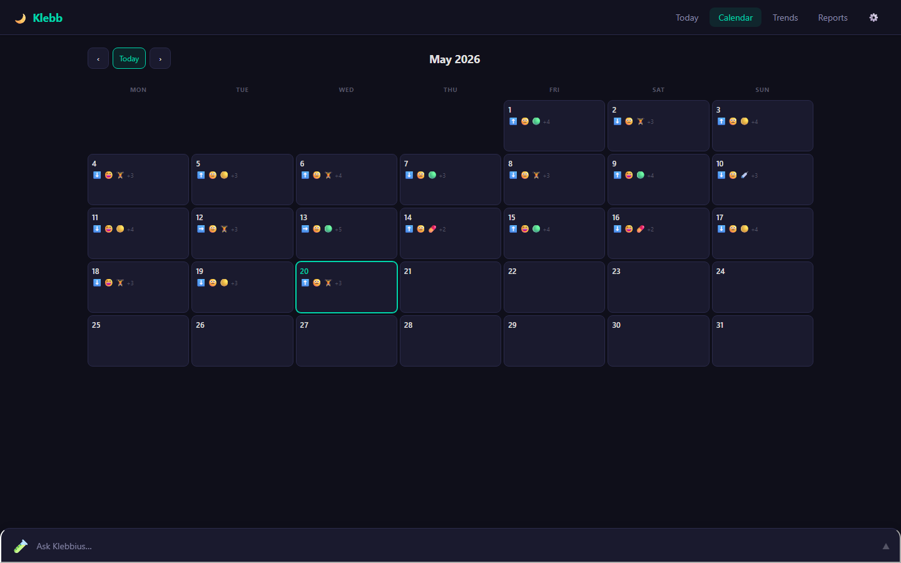
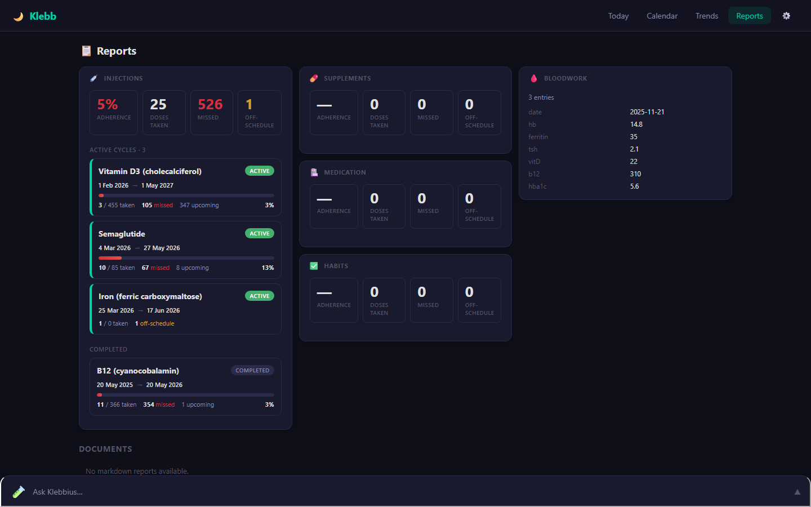

# Klebb

[](https://github.com/Aristocles/klebb/actions/workflows/test.yml)
[](./LICENSE)
[](https://nodejs.org/)

<p align="center">
  
</p>

A **file-driven**, **manifest-based** personal health dashboard. You
drop JSON files into a folder; cards appear. Delete a file; the card is
gone. That's the whole model.

No database. No catalog. No install flow. No build step. Fewer moving
parts than most static-site generators.

Works equally well as:

- A personal dashboard you drive manually
- A target for a chat agent (any OpenAI-compatible LLM) to read and
  to log into
- A multi-user self-hosted install with WebAuthn passkey auth

## Table of contents

- [Quickstart](#quickstart)
- [What is a "card"?](#what-is-a-card)
- [Running with Docker](#running-with-docker)
- [Running tests](#running-tests)
- [Configuration](#configuration)
- [Docs](#docs)
- [Architecture](#architecture)
- [Contributing](#contributing)
- [License](#license)

## How Klebb works

Klebb is **LLM-first**. Cards are JSON files on disk, but you don't
write that JSON yourself in day-to-day use — you talk to a built-in
chat agent that does it for you. "Track my weekly semaglutide cycle
at 0.5mg" turns into a fully configured injection card; "I want a
weight tracker in kg" produces a weight card with the right trend
chart. Starter prompts take this further: paste one into the chat
and the agent builds out a whole dashboard in one conversation.

You still own your data (it's all plain JSON in `$HEALTH_HOME/data/`,
which you can back up, version-control, or edit by hand) but you
don't *have* to touch it. Most users won't.

## Quickstart

```bash
git clone https://github.com/Aristocles/klebb.git
cd klebb
npm install

export HEALTH_HOME=~/klebb-data
mkdir -p "$HEALTH_HOME/data"
```

Then set up a chat gateway (required for onboarding and ongoing use).
Any OpenAI-compatible chat-completions endpoint works; see
[`docs/CHAT-AGENT.md`](docs/CHAT-AGENT.md) for the minimum config.
Minimum:

```bash
export CHAT_ENDPOINT_URL=https://your-gateway/v1/chat/completions
export CHAT_API_KEY=your-bearer-token
export CHAT_MODEL=your-model-id
```

Start the server:

```bash
npm start
# open http://localhost:8080
```

A fresh install shows a Welcome card with three onboarding paths:
**Pick a starter prompt** (recommended), **Describe it yourself**
(ad-hoc chat), or **Hand-author JSON** (for users who already know
what they want and prefer the text editor). Pick one and go.

### Without an LLM

You can still run Klebb without a chat gateway, but the experience
is stripped down: hand-author manifest files into `$HEALTH_HOME/data/`
using the examples in [`templates/`](templates/) and the full authoring
guide in [`docs/CARDS.md`](docs/CARDS.md). The JSON example below is
a minimal weight card to get you started.

### Screenshots

<details open>
<summary><b>Mobile</b></summary>

<p align="center">
  
</p>

<table>
  <tr>
    <td width="33%" valign="top" align="center"><br><sub><b>Trends</b></sub></td>
    <td width="33%" valign="top" align="center"><br><sub><b>Calendar</b></sub></td>
    <td width="33%" valign="top" align="center"><br><sub><b>Reports</b></sub></td>
  </tr>
</table>

<table>
  <tr>
    <td width="50%" valign="top" align="center"><br><sub><b>Navigation</b> — tap through every view.</sub></td>
    <td width="50%" valign="top" align="center"><br><sub><b>Today</b> — touch-scroll through the day's cards.</sub></td>
  </tr>
  <tr>
    <td width="50%" valign="top" align="center"><br><sub><b>Chat</b> — the same agent on a phone-sized canvas.</sub></td>
    <td width="50%" valign="top" align="center"><br><sub><b>Date scrub</b> — tap the arrow to walk back through past days.</sub></td>
  </tr>
</table>

</details>

<details>
<summary><b>Desktop</b></summary>

<p align="center">
  
</p>

<table>
  <tr>
    <td width="33%" valign="top"><br><sub><b>Trends</b> — every numeric card gets a line chart automatically.</sub></td>
    <td width="33%" valign="top"><br><sub><b>Calendar</b> — month grid with per-day markers from any card that opts in.</sub></td>
    <td width="33%" valign="top"><br><sub><b>Reports</b> — adherence and bloodwork tables driven by schedule cards.</sub></td>
  </tr>
</table>

<table>
  <tr>
    <td width="50%" valign="top"><br><sub><b>Navigation</b> — Today, Calendar, Trends, Reports.</sub></td>
    <td width="50%" valign="top"><br><sub><b>Theme toggle</b> — click the logo to switch dark / light.</sub></td>
  </tr>
  <tr>
    <td width="50%" valign="top"><br><sub><b>Today</b> — every card on disk shows up here, in the order their manifest specifies.</sub></td>
    <td width="50%" valign="top"><br><sub><b>Date scrub</b> — the entire dashboard re-renders for any past day.</sub></td>
  </tr>
  <tr>
    <td width="50%" valign="top"><br><sub><b>Chat</b> — the agent can suggest new cards from a natural-language prompt.</sub></td>
    <td width="50%" valign="top"><br><sub><b>Settings</b> — toggle any card off to hide it without touching the JSON.</sub></td>
  </tr>
</table>

<sub>Light theme works for every view — <a href="docs/media/desktop/today-light.png">light Today</a> for reference.</sub>

</details>

## What is a "card"?

Every card is a JSON file that looks like this:

```json
{
  "$schema": "klebb.datafile.v1",
  "meta": {
    "id": "weight",
    "label": "Weight",
    "emoji": "⚖️",
    "view": {
      "enabled": true,
      "component": "generic-card",
      "display": {
        "template": "{kg:round(1)}",
        "unit": "kg",
        "trendArrow": { "field": "kg" }
      }
    },
    "writeable": {
      "fromWebapp": true,
      "maxReadingsPerDay": 1,
      "inputs": [
        { "key": "kg", "type": "number", "required": true }
      ]
    }
  },
  "data": [
    { "date": "2026-04-20", "kg": 85.5 }
  ]
}
```

- `meta.view.display.template` drives what the card shows — no
  component code needed for common cases
- `meta.writeable.inputs` drives the edit form
- `data` is the log; the webapp appends to it, the chat agent reads
  from it
- A plain text file the registry loads on boot (and re-reads via
  `fs.watch` whenever you change it)

For card types that need more than the generic renderer handles
(medication schedules, line charts, markdown docs), there are specialised
renderers you pick by name.

## Running with Docker

A published image is available at `ghcr.io/aristocles/klebb` (multi-arch:
`linux/amd64` and `linux/arm64`). The quickest way to spin up an
instance:

```bash
git clone https://github.com/Aristocles/klebb.git
cd klebb
cp .env.example .env
# edit .env — set HEALTH_ORIGIN, HEALTH_RP_ID, SESSION_SECRET
docker compose up -d
```

Data persists in `./data/` on the host (bind-mounted to `/data` inside
the container). The published release tag (e.g. `v2.1.0`) and `latest`
are stable; image SHAs change per-commit on `main` if you want to track
bleeding edge.

**WebAuthn requires HTTPS.** The compose file binds the app to
`127.0.0.1:10002` on the host so you can front it with a reverse proxy
that handles TLS (Caddy, Cloudflare Tunnel, Traefik, nginx). Example
Caddyfile:

```caddyfile
klebb.example.com {
    reverse_proxy 127.0.0.1:10002
}
```

`HEALTH_RP_ID` in `.env` must match the public hostname exactly (no
scheme, no port). Changing it later invalidates any passkeys already
registered.

### Building locally

```bash
cp docker-compose.override.yml.example docker-compose.override.yml
docker compose up --build
```

The override swaps the published image for `build: .` and exposes the
port on all interfaces for LAN-based dev testing.

### Reaching a chat endpoint on the host

If you're running an OpenAI-compatible chat endpoint on the host (for the
chat widget), point `CHAT_ENDPOINT_URL=http://host.docker.internal:<port>/v1/chat/completions`
in `.env`. The compose file already maps that hostname to the host via
`extra_hosts: host.docker.internal:host-gateway`.

## Ingesting reports

Klebb watches `$HEALTH_HOME/inbox/` and turns anything you drop in
there into a markdown report under `$HEALTH_HOME/reports/`, ready for
the chat agent to read on demand. Supports `.pdf` (via `pdftotext`),
`.png` / `.jpg` / `.jpeg` (via `tesseract`), `.txt` / `.md` verbatim,
and `.mp3` / `.wav` / `.m4a` / `.ogg` / `.opus` (via `ffmpeg` + Fish
ASR; requires `FISH_AUDIO_API_KEY`).

```bash
scp bloods.pdf myhost:/data/inbox/
```

The Docker image ships with all four binaries baked in, so this works
out of the box. Failures land in `$HEALTH_HOME/inbox/_failed/` with a
sibling `.error` file. See [`docs/REPORTS.md`](docs/REPORTS.md) for
the full workflow, output format, troubleshooting, and the chat
round-trip.

## Running tests

```bash
npm test                  # unit + API integration tests
npm run test:e2e          # Playwright end-to-end (headless)
npm run test:e2e:headed   # same, with a visible browser
```

Unit + API integration tests spin up ephemeral `HEALTH_HOME`
directories and the full HTTP server on random ports, exercising the
registry, Settings API, display-template engine, bearer-auth path,
migration scripts, and repo-hygiene scanners. ~800 tests, runs in
~15 seconds.

End-to-end tests drive Chromium against the same sandbox harness and
cover user-visible interaction (rendering, navigation, forms). See
[`docs/TESTING.md`](docs/TESTING.md) for the rubric on which layer a
new test belongs in.

CI runs all three layers on every push and pull request.

## Configuration

Minimum env vars to start:

| Var | Default | Purpose |
|-----|---------|---------|
| `HEALTH_HOME` | `~/klebb` | Where your data lives (`data/`, `credentials/`, `sessions/`) |
| `PORT` | `8080` | HTTP listen port |
| `HOST` | `0.0.0.0` | Bind address |

For production deploys you MUST also set:

| Var | Purpose |
|-----|---------|
| `HEALTH_ORIGIN` | Public origin (e.g. `https://klebb.example.com`) |
| `HEALTH_RP_ID` | WebAuthn Relying Party ID (hostname of `HEALTH_ORIGIN`) |

Optional feature flags:

| Var | Purpose |
|-----|---------|
| `AGENT_API_TOKEN` | Bearer token for server-to-server card writes |
| `CHAT_ENDPOINT_URL`, `CHAT_API_KEY`, `CHAT_MODEL` | Chat widget endpoint (any OpenAI-compatible chat-completions URL) |
| `CHAT_AGENT_NAME`, `CHAT_AGENT_EMOJI` | Chat widget branding |
| `FISH_AUDIO_API_KEY`, `FISH_AUDIO_DEFAULT_VOICE` | Voice chat |
| `HEALTH_INSTANCE_NAME`, `HEALTH_RP_NAME` | UI branding |
| `KLEBB_DEMO` | Set to `1` to run as a public no-credentials demo (see below) |

See [`config/env.js`](config/env.js) for the complete list with
defaults.

### Running as a public demo

`KLEBB_DEMO=1` flips the server into a public-demo mode used to host
read-anyone instances at e.g. `demo.klebb.app`:

- The login page replaces the passkey prompt with a single
  "Enter the demo" button that mints a session for a shared `demo`
  user.
- All passkey, invite, and setup-wizard routes return `410 Gone`.
- `POST /api/chat` short-circuits with a fixed assistant reply
  explaining there's no AI gateway connected. No outbound HTTP.
- Voice endpoints (`/api/voice/*`) return `503`.
- `PATCH /api/manifests/:id` rejects `meta.enabled` mutations and the
  `/api/settings/cards/:id/(enable|disable)` endpoints return `403`,
  so visitors can't hide cards.
- The authenticated app shell shows a dismissible-once banner pointing
  back to `klebb.app` for self-hosted use.

Pair the flag with a curated dataset under `$HEALTH_HOME/data/` and a
periodic reset (cron, systemd timer, or container restart) to keep the
demo predictable.

## Docs

- [`docs/CARDS.md`](docs/CARDS.md) — How to write and manage cards (user guide)
- [`docs/RECIPES.md`](docs/RECIPES.md) — 12 copy-pasteable card patterns (cookbook)
- [`MANIFEST-SCHEMA.md`](MANIFEST-SCHEMA.md) — Manifest format reference
- [`docs/CHAT-AGENT.md`](docs/CHAT-AGENT.md) — Chat widget + server-to-server integration
- [`docs/VOICE.md`](docs/VOICE.md) — Voice chat (Fish Audio) configuration
- [`docs/REPORTS.md`](docs/REPORTS.md) — Inbox-driven report ingest (PDF, scans, notes, audio)
- [`docs/DEPLOY.md`](docs/DEPLOY.md) — Single-user + multi-user deploy guide
- [`docs/CI.md`](docs/CI.md) — CI workflow overview
- [`CONTRIBUTING.md`](CONTRIBUTING.md) — Contributor conventions
- [`CHANGELOG.md`](CHANGELOG.md) — Release notes
- [`SECURITY.md`](SECURITY.md) — Security policy

## Architecture

```
server.js                         HTTP + static + API entry
config/
  env.js                          env + branding + gateway config
  paths.js                        HEALTH_HOME resolution
manifests/
  registry.js                     discover / validate / cache / write
auth/
  webauthn.js                     passkey register + verify
  invites.js                      invite-code issuance
voice/
  fish.js                         Fish Audio TTS/ASR (optional)
  transcode.js                    ffmpeg pipe -> 16 kHz mono WAV (shared)
ingest/
  pipeline.js                     inbox watcher orchestrator
  watcher.js                      fs.watch + debounce wrapper
  extract.js                      extension-keyed dispatcher
  extractors/                     pdf / image / text / audio extractors
  writeReport.js                  frontmatter + atomic .md write
  catalogue.js                    parses headers + builds chat catalogue
public/
  js/
    app.js                        top-level routing
    renderer-registry.js          component name → tag name map
    components/
      eh-base-card.js             base class (fetch + loading + error)
      eh-generic-card.js          zero-code card driven by display templates
      eh-input-form.js            manifest-driven input form
      eh-settings-view.js         master enable/disable toggle list
      eh-view-renderer.js         composes cards into a grid
      ...                          specialised renderers (schedule, checklist, charts)
    lib/
      display-template.js         template engine (UMD — Node tests load it)
      display-template.esm.js     same engine, ES module flavour for browser
scripts/
  deploy.sh                       atomic release + auto-rollback
  verify-install.sh               pre-flight health check
  migrate-*.js                    schema + card-shape migrations
  invite.js / revoke.js / list.js auth CLI
tests/
  helpers/sandbox.js              ephemeral HEALTH_HOME + server for each test
  *.test.js                       runs via `npm test`
systemd/
  klebb@.service                  templated unit for multi-instance hosts
docs/                             user + contributor docs
```

## Contributing

See [`CONTRIBUTING.md`](CONTRIBUTING.md). Short version: `npm test`
must pass, keep commits focused, update `CHANGELOG.md` under
`## Unreleased`, and don't commit secrets or personal paths (the
hygiene tests will catch you).

Bug reports + feature requests: use the templates at
<https://github.com/Aristocles/klebb/issues/new/choose>.

### Contributing templates and prompts

The easiest way to contribute to Klebb is to add a starter card or
prompt. Both live in the repo as plain files: no code required.

- **Templates** — single-card starter manifests that appear in the Add
  Card gallery. Drop a `.klebb.json` into `templates/`. See
  [`CONTRIBUTING-TEMPLATES.md`](CONTRIBUTING-TEMPLATES.md).
- **Prompts** — natural-language prompts for the chat agent that build
  multi-card protocols (GLP-1 cycles, supplement stacks, post-op
  recovery, etc.). Drop a `.md` with frontmatter into `prompts/`. See
  [`CONTRIBUTING-PROMPTS.md`](CONTRIBUTING-PROMPTS.md).

Both are surfaced in-app through the welcome card's three entry
points. Contributions here help every user of Klebb without requiring
them to know the manifest schema.

Security issues: see [`SECURITY.md`](SECURITY.md). Don't open a public
issue for those.

## License

GNU Affero General Public License v3.0 (AGPL-3.0-only).
See [`LICENSE`](LICENSE) for the full text, [`NOTICE`](NOTICE) for
the project copyright, and [`AUTHORS.md`](AUTHORS.md) for the list
of contributors.

Copyright (C) 2026 Aristocles &lt;https://github.com/Aristocles&gt;.
